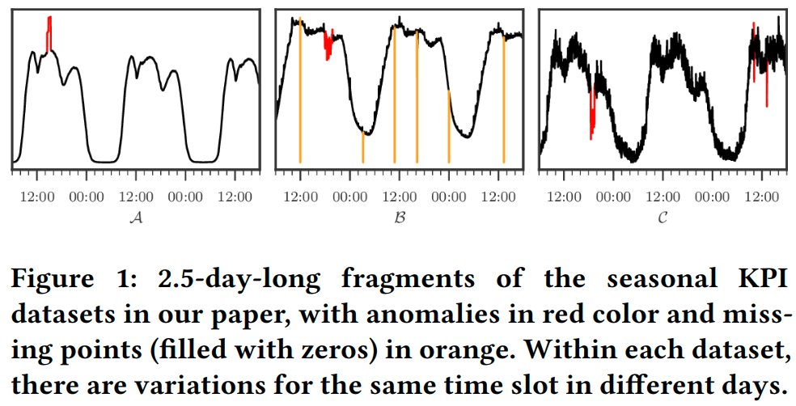
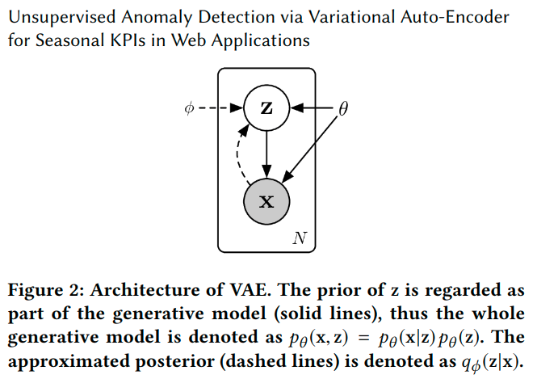
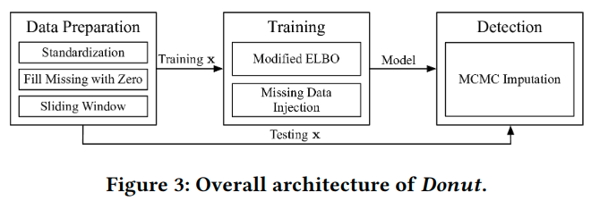
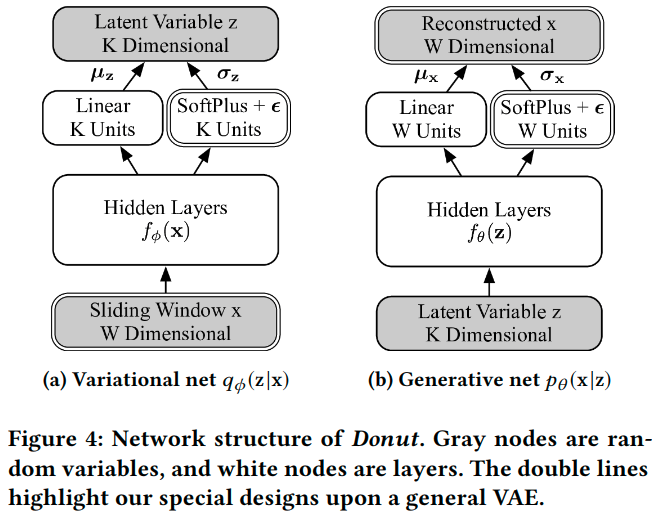

# DONUT PAPER

## 1. INTRODUCTION.

*Donut* is an unsupervised learning anomaly detection algorithm based on Variational Auto-Encoder.

This algorithm can work with unlabeled data; can take advantage of occasional labels when available.

The contribution:

1. There're 3 techniques: Modified ELBO, Missing Data Injection for training, MCMC Inputation for detection. The best of F-score range from 0.75 - 0.9. 
2. VAE Anomaly Detection training on both **normal data** and **abnormal data**.
3. Propose a novel KDE interpretation in z-space for *Donut*. Discover a *time gradient effect* in laten z-space.

## 2. BACKGROUND & PROBLEM

### 2.1. Context and Anomaly Detection in General

We can now formalize the “**normal patterns**” of seasonal KPIs asa combination of two components: (1) the **seasonal** patterns with local variations, and (2) the statistics of the **Gaussian noises**.

Using **anomalies** to denote the record points which do not follow normal patterns; **abnormal** to denote both of the *anomaly* and *missing points*.

**Formulation**: for any time *t*, given historical observation $x_{t-T+1}, ..., x_{t}$, determine whether an anomaly occurs (denote by $y_{t}=1$).

- Computing $p(y_{t}=1|x_{t-T+1},...,x_{t})$, do not computing $y_{t}$ directly.
- Using **threshold**.

### 2.2. Previous Work

**Traditional Statistical Model**: these detectors see only limited use in the practice.

**Supervised Ensemble Approaches**: showed promising results, but they heavily rely on good labels, which is gen-erally not feasible in large scale applications.

**Unsupervised approaches and deep generative models**: focus on normal patterns instead of anomaly patterns.

- Learning normal patterns can be seen as learning the distribution of training data
- Using advantages of Deep Learning Models.
- VEA-based anomaly detection was not designed for **time series**.
- VRNN shows long training time & poor performance.
- Assumes training only on clean data, which is infeasible in their context.

### 2.3. Problem Statement.

**We aim at an unsupervised anomaly detection algorithm based ondeep generative models with solid theoretical explanation,and this algorithm can take advantage of the occasionallyavailable labels.**

### 2.4. Background of Variational Auto-Encoder.

## 3. ARCHITECTURE

### 3.1. Network Structure

KPIs is sequential variate, but VAE is not sequential model; thus using **sliding window**: for each input $x_{t}$ point, using $[x_{t-W+1}, ..., x_{t}]$ vector as the sliding window of VAE.

1. $X=[x_{t-W+1},x_{t-W+2},...,x_{t}]$ is **Input Sliding Window**.
2. At **Hidden Layers**, hidden features are extracted from $X$ (for **each** component dimention of $X$) with neural network transform **scalar function**, transforms from $W$ dimention input to $K$ dimention latent: $f_{\phi}(X)$
3. The $K$ dimention means vector ${\mu}_{Z}$ are derived from **linear** layer transform: ${\mu}_{Z}=W_{{\mu}_{Z}}^{T}.f_{\phi}(X)+b_{{\mu}_{Z}}$
4. The $K$ dimention deviations vector ${\sigma}_{Z}$ are derived from **SoftPlus** function: ${\sigma}_{Z}=SoftPlus[W_{{\sigma}_{Z}}^{T}.f_{\phi}(X)+b_{{\sigma}_{Z}}]+{\epsilon}$ with $SoftPlus({\alpha})=log[1+exp(\alpha)]$
5. Each component of $K$ dimention of Latent Variable Z is sampled with each corresponding component of means vector ${\mu}_{Z}$ and deviations vector ${\sigma}_{Z}$.
6. The Generative Network process will be similar with Variational Network process above.

**NOTE**:

1. The $\epsilon$ parameter is the trick to prevent vanish computing.
2. They using fully-connected layers for hidden layers.

### 3.2. Training

**Sampling**: Instead of sampling $z\sim N({\mu}_{z},{\sigma}_{z}^2)$, a random variable $\xi\sim N(0,1)$ is sampled to scaling $z$ as $z(\xi)={\mu}_{z}+{\xi}*{\sigma}_{z}$

**Modified ELBO**:

1. Using ${\alpha}_{w}$ as an indicator. ${\alpha}_{w}=1$ when $x_{w}$ is normal; and ${\alpha}_{w}=0$ when $x_{w}$ is anomaly or missing.
2. $\beta =\sum_{w=1}^{W}{\alpha}_{w}$
